# Jason + Chatbots

By [Débora Engelmann](https://github.com/DeboraEngelmann), 
[Juliana Damasio Oliveira](https://github.com/julianadamasio), 
[Olimar Teixeira Borges](https://github.com/olimarborges), 
[Tabajara Krausburg](https://github.com/TabajaraKrausburg) e 
[Marivaldo Vivan](https://github.com/Vivannaboa)

**Parte do código utilizado nesse projeto é de autoria de [Jomi F. Hubner](https://github.com/jomifred) e [Cleber Jorge Amaral](https://github.com/cleberjamaral) Disponível em [JaCaMo-Rest](https://github.com/jacamo-lang/jacamo-rest).**

Você precisará ter instalado em seu computador:

[Git](https://git-scm.com/downloads), 
[Java SE 8](https://www.oracle.com/java/technologies/javase-jdk8-downloads.html), 
[Eclipse](https://www.eclipse.org/downloads/) - Oxygen ou superior, 
[JaCaMo](http://jacamo.sourceforge.net/eclipseplugin/tutorial/),
[Gradle](https://gradle.org/install/),
[Postman](https://www.postman.com/downloads/),
[Docker](https://www.docker.com/get-started) e 
[SDK GCP](https://cloud.google.com/sdk/docs/quickstarts)

**Todos os comandos deste tutorial foram testados no Ubuntu 20.04, para outros sistemas operacionais e outras distribuições do Ubuntu podem haver variações**

**Use a seguinte lista para navegar para o tutorial correspondente a cada tarefa**

1. [Baixando e configurando projeto de integração](#baixando-e-configurando-projeto-de-integração)
2. [Testando projeto localmente com o Postman](#testando-projeto-localmente-com-o-postman)
3. [Testando projeto localmente com o pagekite](#testando-projeto-localmente-com-o-pagekite)
4. [Testando projeto localmente com o ngrok](#testando-projeto-localmente-com-o-ngrok)
5. [Criando imagem Docker](#criando-imagem-docker)
6. [Configurando projeto GCP e subindo aplicação](#configurando-projeto-gcp-e-subindo-aplicação)
7. [Criando intenção e configurando fulfillment no Dialogflow](#criando-intenção-e-configurando-fulfillment-no-dialogflow)
8. [Incluindo a integração no seu projeto JaCaMo existente](#incluindo-a-integração-no-seu-projeto-jacamo-existente)

## Baixando e configurando projeto de integração

Abra o `Eclipse` e selecione o menu `File/Import`.


Na Caixa de diálogo selecione `Git/Projects from Git` e clique em `Next >`

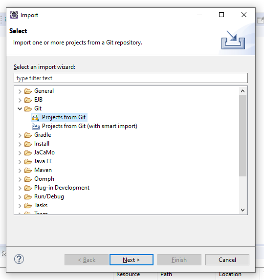

Selecione a opção `Clone URI` e clique em `Next >` novamente. Em `URI` coloque o link: https://github.com/DeboraEngelmann/helloworld_from_jason.git e clique em `Next >`.

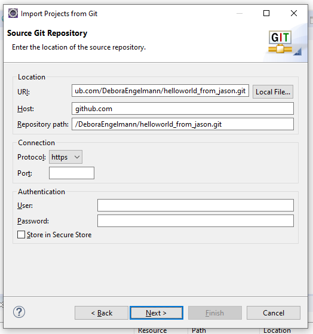

Selecione `master` e clique em `Next >`. Escolha o diretório onde o projeto será salvo e clique em `Next >`.

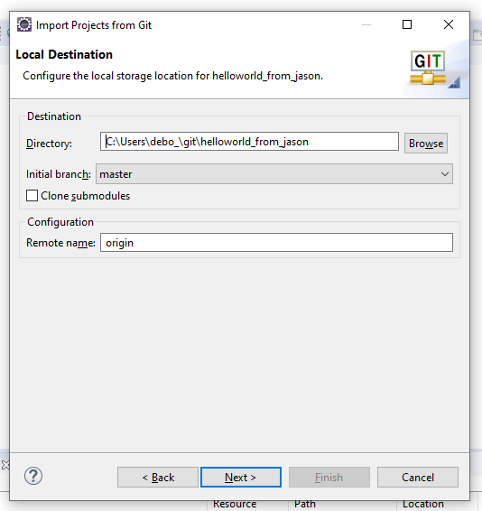

Selecione a opção Import existing Eclipse projects e clique em `Next >`.

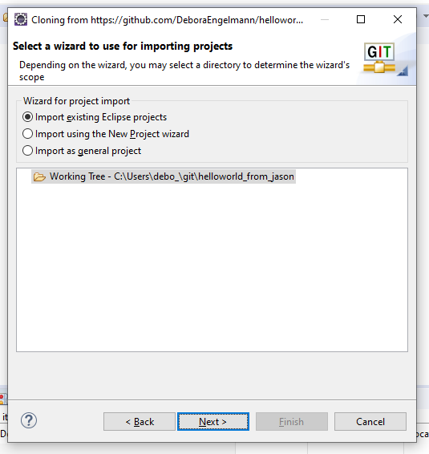

Clique em `Finish`.

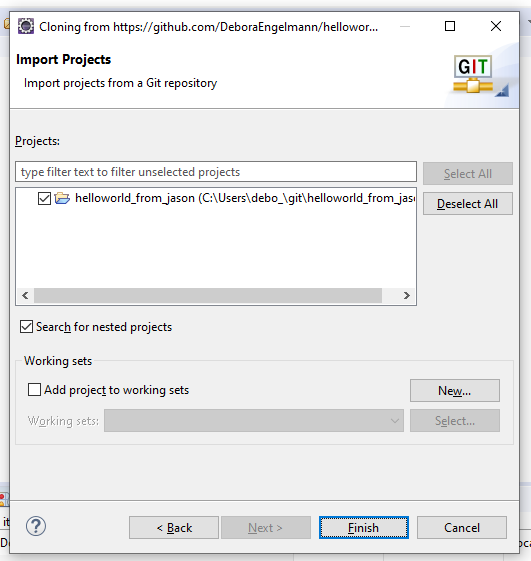

O eclipse pode levar alguns instantes para conseguir sincronizar as dependencias do Gradle, enquanto estiver sincronizando você verá a informação na barra inferior conforme a imagem a seguir.

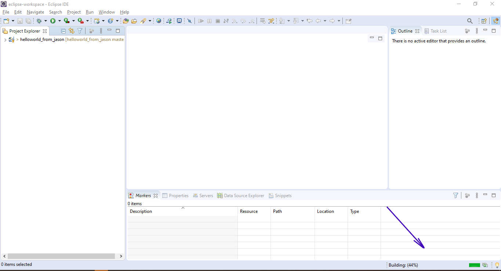


## Testando projeto localmente com o Postman


Abra o projeto no terminal

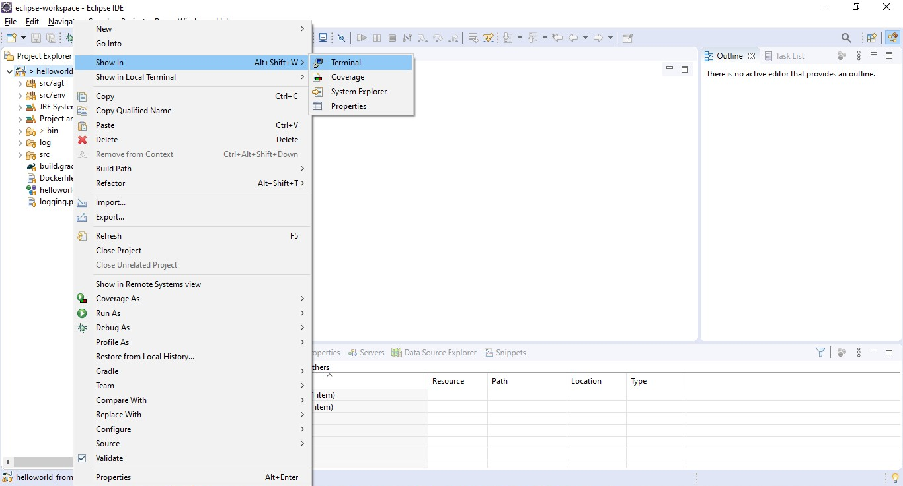

Caso prefira, pode abrir outro terminal e navegar até a pasta do projeto.

Rode o comando `gradle build` e logo após, `gradle run`. Isso pode levar algum tempo.

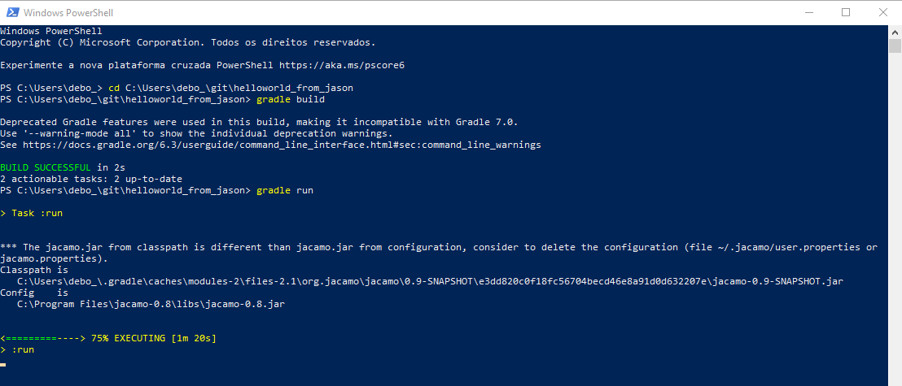

O `MAS Console` será aberto. Copie o endereço em que o `JaCaMo Rest API` está rodando (caso esteja aparecendo 0.0.0.0:8080 utilize o endereço http://localhost:8080/).

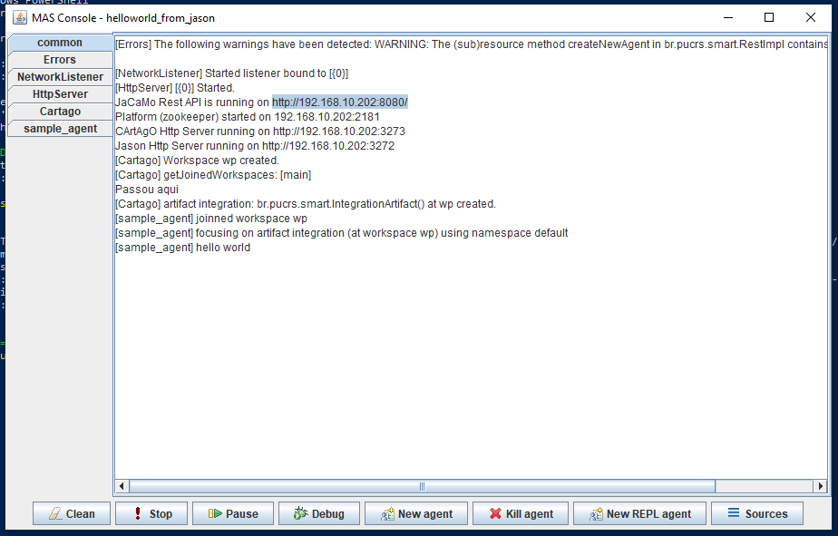

Abra o `Postman` em `create a request` selecione o tipo `POST` e cole o endereço do `JaCaMo Rest API` na barra de endereço. 
Na aba `Body` selecione o tipo `raw` e arquivo do tipo `JSON`, e cole o seguinte código no corpo da requisição:

```
{
  "responseId": "d181b9c7-22ae-4bab-bab3-9dfa70310452-5fd6c646",
  "queryResult": {
    "queryText": "Diga oi ao agente Jason",
    "parameters": {
      
    },
    "allRequiredParamsPresent": true,
    "fulfillmentText": "Here will be called the Jason agent!",
    "fulfillmentMessages": [
      {
        "text": {
          "text": [
            "Here will be called the Jason agent!"
          ]
        }
      }
    ],
    "intent": {
      "name": "projects/integration-example-nymoic/agent/intents/ea529dec-e89f-48aa-bf43-527264379f06",
      "displayName": "Call Jason Agent"
    },
    "intentDetectionConfidence": 1,
    "diagnosticInfo": {
      "webhook_latency_ms": 405
    },
    "languageCode": "en"
  },
  "webhookStatus": {
    "message": "Webhook execution successful"
  }
}
```

Esse código é um exemplo de requisição feita pelo Dialogflow. Vamos verificar se nossa aplicação consegue responde-la.

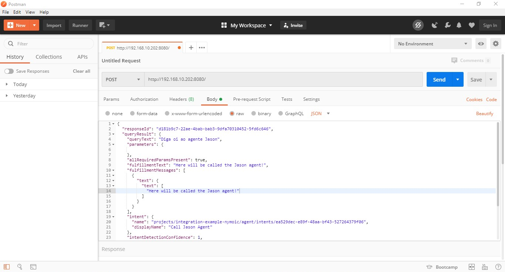

Verifique a resposta recebida do agente.

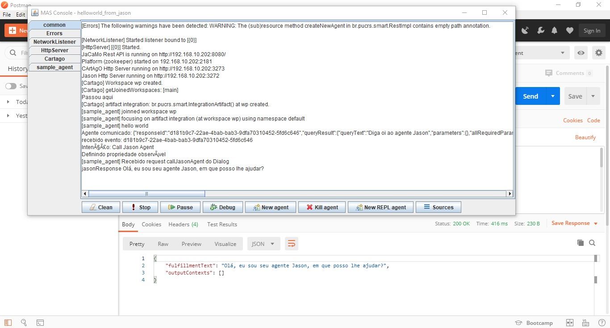

## Testando projeto localmente com o pagekite

**O [pagekite](http://pagekite.net/) é uma solução open source que gera um URL seguro e instantâneo para o servidor localhost rodando na sua máquina.**  
**Para utilizá-lo você precisa ter o [Python 2.7](https://www.python.org/download/releases/2.7/) instalado.**

Acesse http://pagekite.net/ clique em `Download` e siga os passos de instalação para o seu sistema operacional

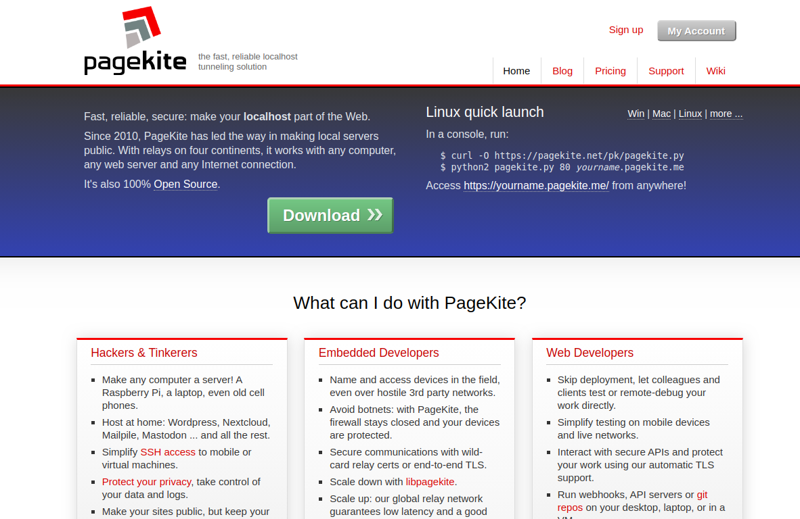

Clique em `Sign up` e informe os dados solicitados para se cadastrar.

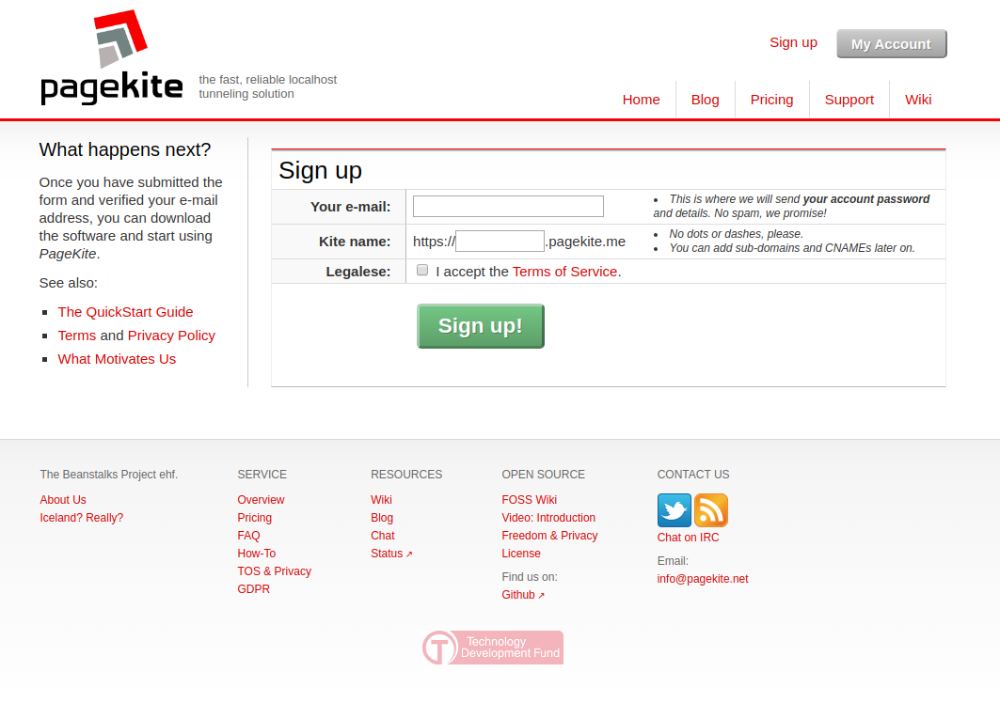

Você vai receber um e-mail de ativação. Clique no link de ativação recebido no seu e-mail para poder utilizar a sua conta.

Com a aplicação JaCaMo rodando (`gradle run`), abra um novo terminal e  navegue até a pasta onde o pagekit foi instalado e rode o comando.

```
python2.7 pagekite.py --signup
```
Siga as instruções no terminal e informe os dados solicitados pelo `pagekite`.

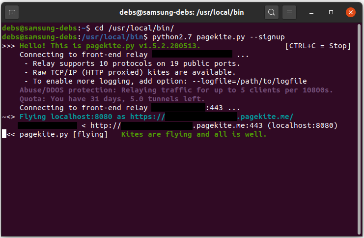

Caso ele esteja apontando para a porta 80, você pode parar o serviço e alterar o arquivo de configuração `.pagekite.rc` que ele cria na pasta `home` trocando o número da porta para `8080`. E logo após, rodar o comando acima novamente.

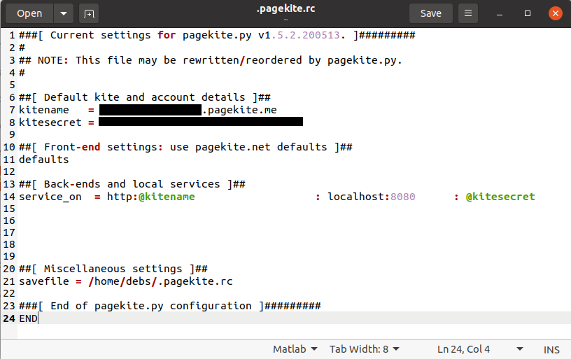

O link da sua aplicação será `https://<o nome do kite informado no momento da inicialização>.pagekite.me`. Você pode vêlo também acessando a sua conta em http://pagekite.net/ . Cole esse link https copiado na aba fullfilment do seu agente do Dialogflow em Webhook/URL e clique em Save.
Para ver como criar intenções do dialogflow clique [aqui](#criando-intenção-e-configurando-fulfillment-no-dialogflow).

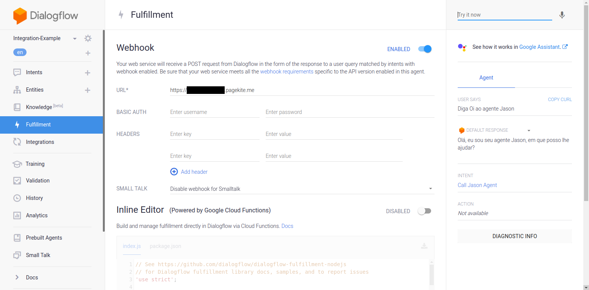

Agora, você já pode fazer chamadas diretamente do seu chatbot no Dialogflow para o seu agente Jason rodando na sua máquina. 

#### Links Úteis
- http://pagekite.net/
- http://pagekite.net/downloads
- http://pagekite.net/support/quickstart/#firstrun
- http://pagekite.net/support/intro/


## Testando projeto localmente com o ngrok

**O [ngrok](https://ngrok.com/) é outra alternativa que também gera um URL seguro e instantâneo para o servidor localhost rodando na sua máquina.**  

Acesse https://ngrok.com/ e clique em `Get started for free`.

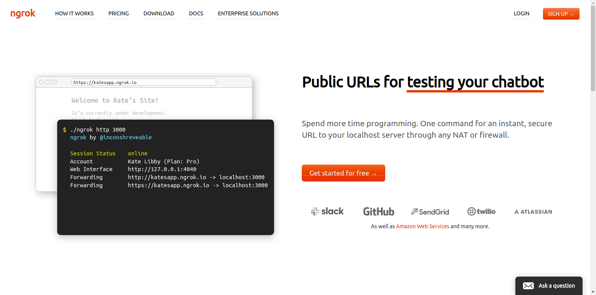

Você pode se cadastrar preenchendo o formulário, ou usar a sua conta do Google ou do Github para acessar o serviço.  
Siga as instruções de instalação de acordo com seu sistema operacional.

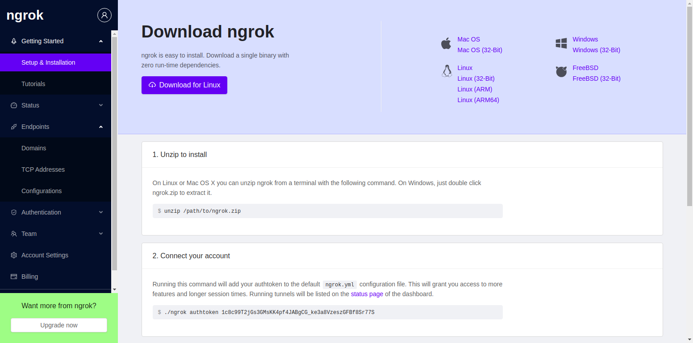

Com a aplicação JaCaMo rodando (`gradle run`), abra um novo terminal e navegue até a pasta onde o `ngrok` está salvo. Rode o comando a seguir:
```
./ngrok http 8080
```
Copie o link https gerado pelo `ngrok`.

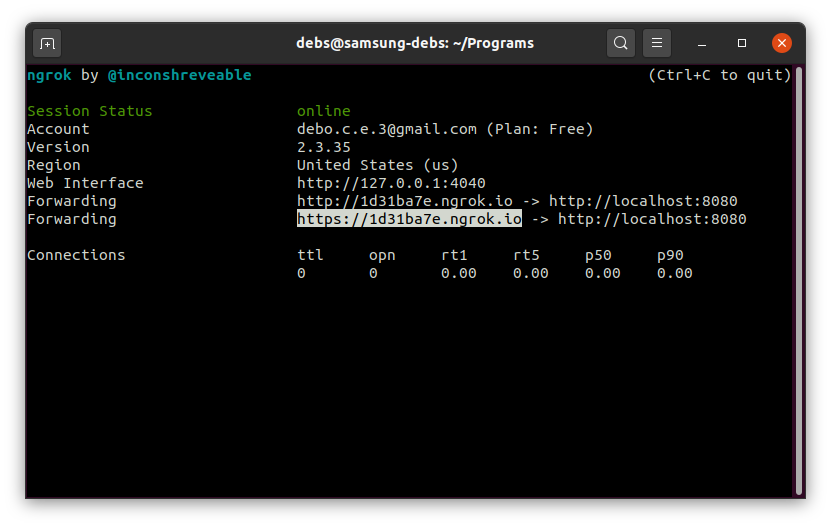

Cole esse link https copiado na aba `fullfilment` do seu agente do Dialogflow em `Webhook/URL` e clique em `Save`.  
Para ver como criar intenções do dialogflow clique [aqui](#criando-intenção-e-configurando-fulfillment-no-dialogflow).


Agora, você já pode fazer chamadas diretamente do seu chatbot no Dialogflow para o seu agente Jason rodando na sua máquina.  

Obs. 
 - A limitação de uso na conta free do `ngrok` é de 40 conexões/minuto.
 - Cada vez que rodar o `ngrok` ele gera uma nova URL, então é necessário trocar a URL no Dialogflow todas as vezes. Porém, você pode parar e reiniciar a sua aplicação JaCaMo várias vezes sem a necessidade de reiniciar a execução do `ngrok`.

#### Links Úteis
- https://ngrok.com/
- https://ngrok.com/docs


## Criando imagem Docker

Para instalar o docker rode os comandos a seguir.

**(Os comandos de instalação a seguir são adequados para o Ubuntu a partir da versão 19)**

```
sudo apt-get update
```

```
apt-cache policy docker-ce
```

```
sudo apt-get install -y docker-ce
```

```
sudo systemctl status docker
```

Rode o comando a seguir para configurar as permissões do Docker para o seu usuário.

```
sudo usermod -a -G docker <YourUser>
```

Navegue até o diretório do projeto e rode o comando a seguir para criar a imagem Docker (caso queira colocar outro nome na imagem altere o `chatbot-integration` no comando).

```
docker build . -t chatbot-integration
```
Para testar a imagem você pode rodar o comando a seguir. 

```
docker run -ti chatbot-integration
```

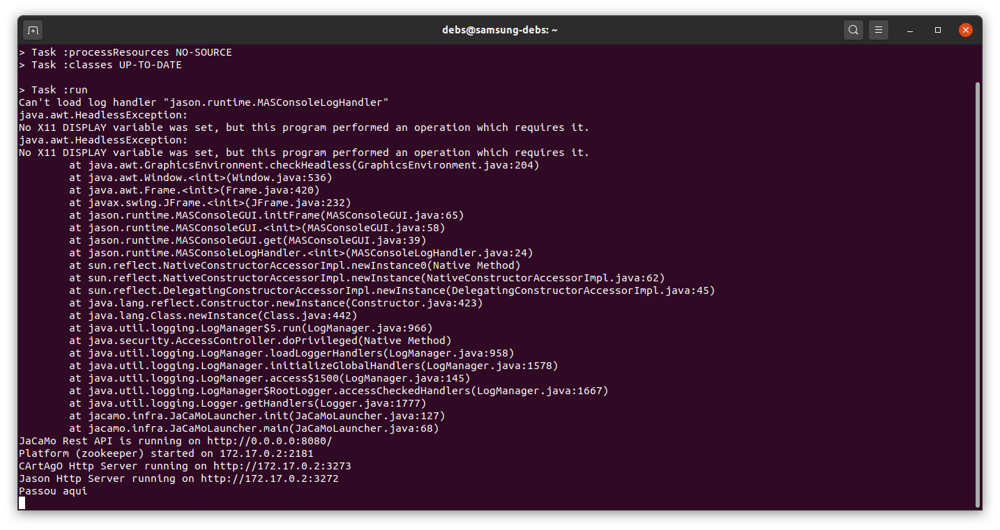

**O erro que aparece no terminal está relacionado á interface gráfica que o JaCaMo procura para iniciar mas não encontra. Apesar do erro, a aplicação permanece rodando e processando as requisições.**

Voce pode utilizar o endereço http://localhost:8080/ para fazer o teste com o Postman da mesma forma que foi feito anteriormente.

#### Links Úteis
- https://medium.com/@Grigorkh/how-to-install-docker-on-ubuntu-19-04-7ccfeda5935
- https://docs.docker.com/
 
## Configurando projeto GCP e subindo aplicação

Para instalar o SDK, adicione a URI da distribuição do Cloud SDK como um package source.  
```
echo "deb [signed-by=/usr/share/keyrings/cloud.google.gpg] http://packages.cloud.google.com/apt cloud-sdk main" | sudo tee -a /etc/apt/sources.list.d/google-cloud-sdk.list
```
Importe a chave pública do Google Cloud Platform.  
```
curl https://packages.cloud.google.com/apt/doc/apt-key.gpg | sudo apt-key --keyring /usr/share/keyrings/cloud.google.gpg add -
```
Atualize o package list e instale o Cloud SDK.  
```
sudo apt-get update && sudo apt-get install google-cloud-sdk  
```
Para iniciar o SDK execute o seguinte comando.
```
gcloud init
```
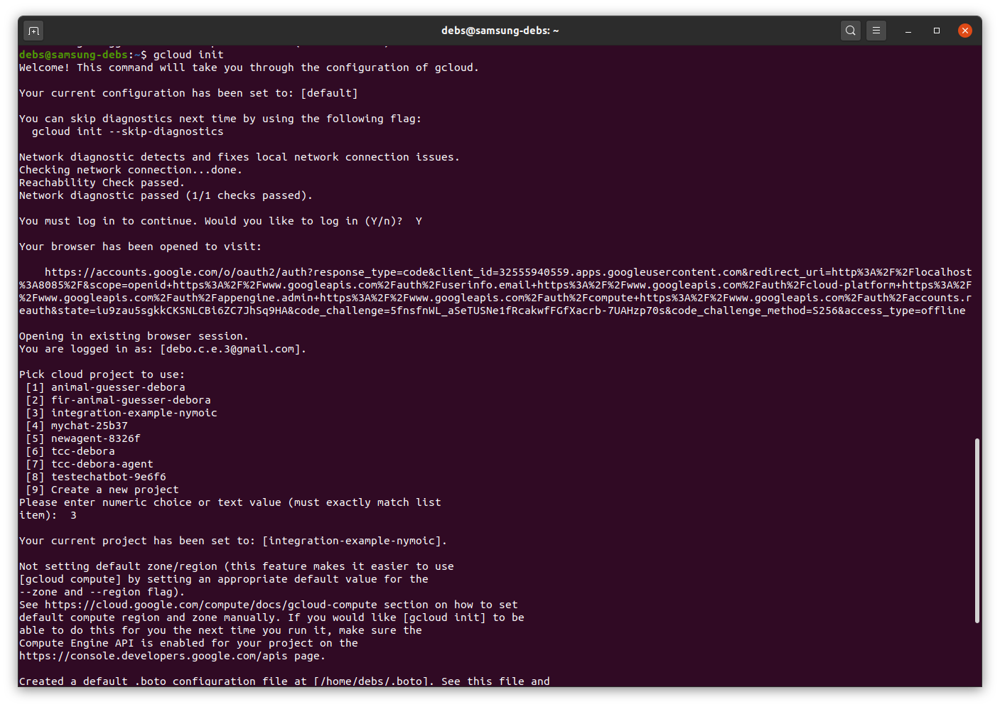

Siga as instruções para selecionar um projeto já criado ou criar um novo projeto.

Para configurar o Docker para usar o GCloud rode o comando a seguir.  
```
gcloud auth configure-docker
```
O comando abaixo serve para adicionar uma tag á imagem que acabamos de criar e definir a URL para onde vamos envia-la.  
```
docker tag chatbot-integration gcr.io/<YourProjectId>/chatbot-integration
```
Para subir a imagem para o GCP use o comando a seguir.  
```
docker push gcr.io/<YourProjectId>/chatbot-integration
```

Acesse https://console.cloud.google.com/ (confira se o projeto está selecionado corretamente). No menú lateral selecione a opção `Container Registry`.

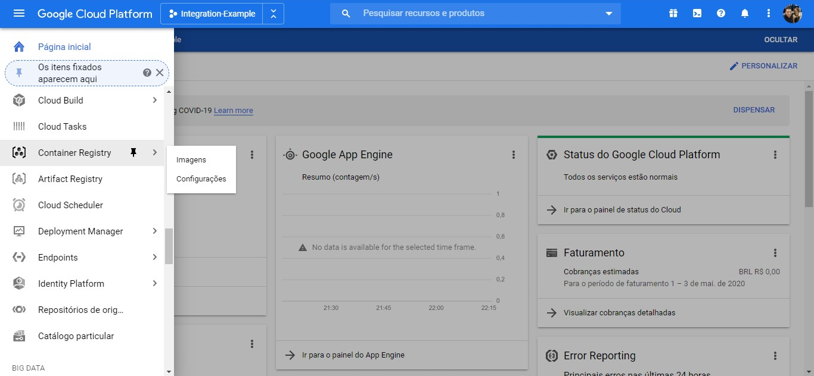

Será listado o container que acabamos de subir.  
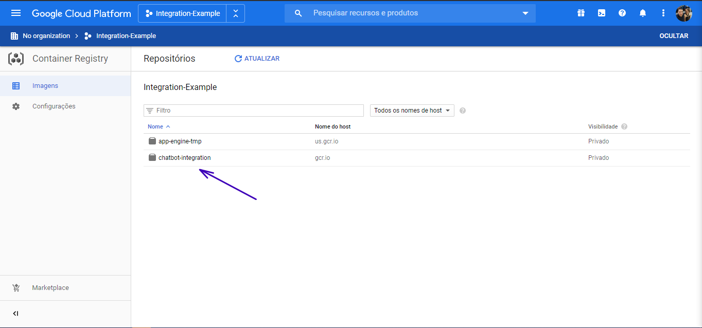

Agora, será necessário inicializar a imagem que acabamos de criar em um novo container. Para isso, acesse o mení `Cloud Run`.  
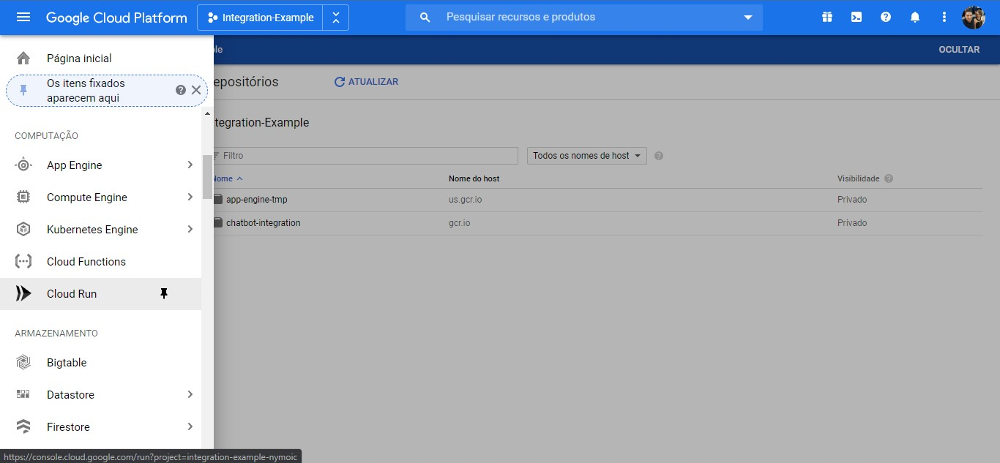

Clique em `Criar Serviço`.


Dê um nome para o serviço, marque a opção `Permitir invocações não autenticadas` e clique em `Próxima`.

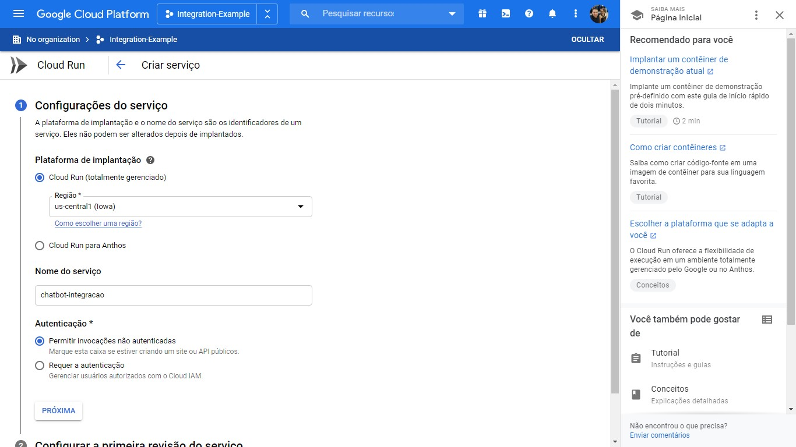

Clique em `Selecionar` e procure a imagem que subimos.

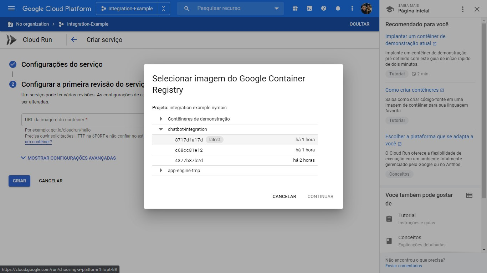

Clique em `Mostrar configurações Avançadas` e altere a quantidade de `Memória alocada` para 512MB e clique em `Criar`.

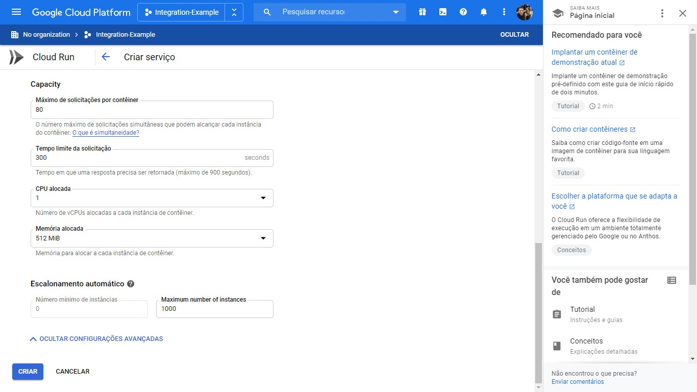

Na tela seguinte quando a flag que indica o status estiver verde, a URL também estará disponível para ser copiada.

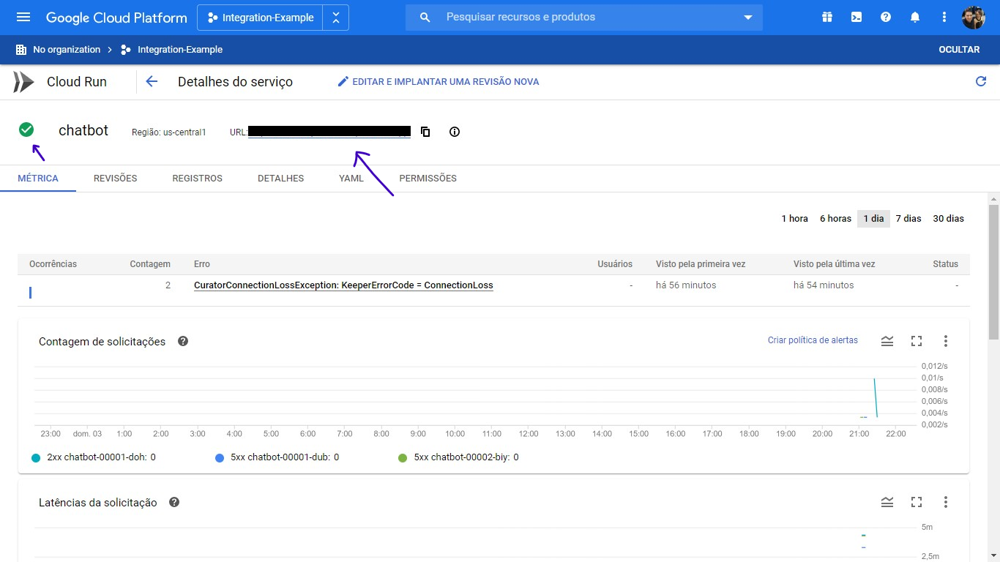

Voce pode utilizar o endereço da URL para fazer o teste com o Postman da mesma forma que foi feito anteriormente.

#### Links Úteis:
- https://cloud.google.com/sdk/docs/quickstart-debian-ubuntu
- https://cloud.google.com/run/docs/using-gcp-services?hl=pt-BR
- https://cloud.google.com/run/docs/testing/local?hl=pt-BR

## Criando intenção e configurando fulfillment no Dialogflow

Crie uma nova intenção no seu chatbot Dialogflow, coloque o nome de `Call Jason Agent` crie algumas `Training phrases` como por exemplo:

- Diga oi ao agente Jason
- Chame o agente Jason
- Quero falar com o agente Jason

E no ítem `Fulfillment` habilite o webhook. Salve a intenção.

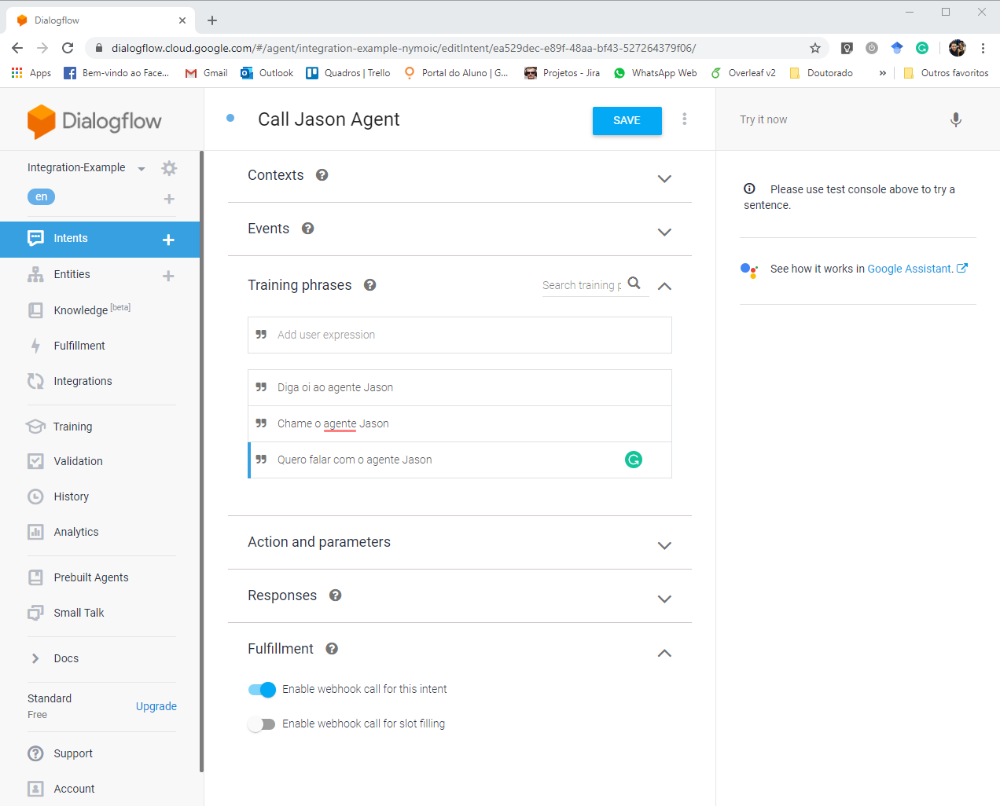

Selecione a aba `Fulfillment` habilite a opção `Webhook`, cole a URL da aplicação do GCP e salve.

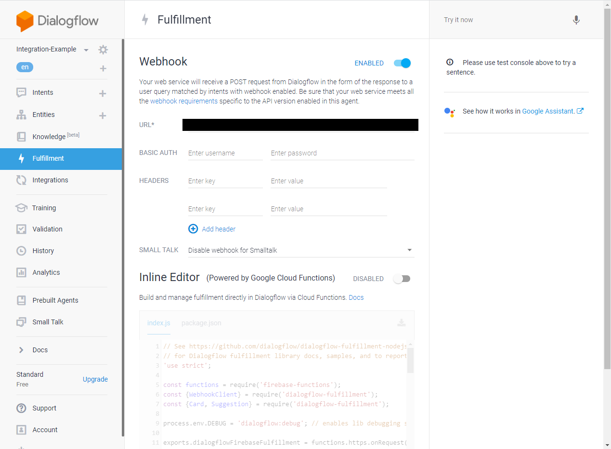

Agora podemos utilizar uma das frases de trinamento cadastradas na nossa intenção para verificar se estamos conseguindo contato com nosso agente Jason.

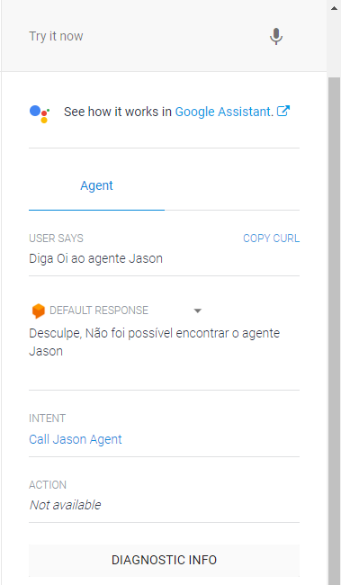

#### Links Úteis:
- https://cloud.google.com/dialogflow/docs/quick/fulfillment
- https://cloud.google.com/dialogflow/docs/fulfillment-overview

## Incluindo a integração no seu projeto JaCaMo existente

Se ainda não tiver uma, crie uma pasta `lib` na raiz do seu projeto.

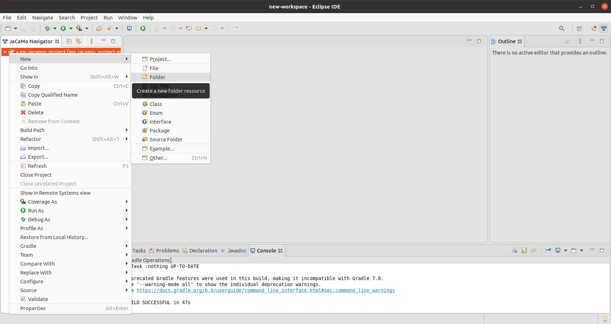

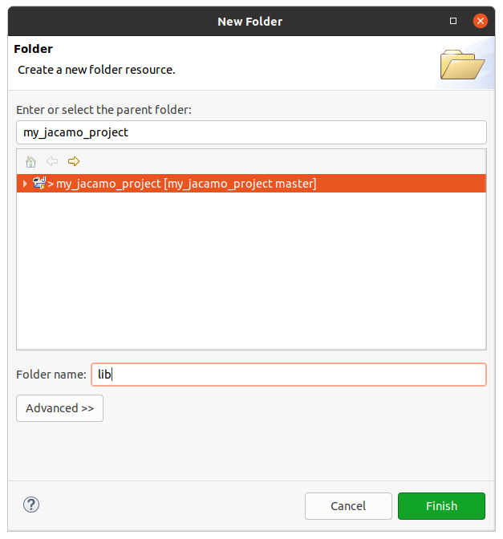

Baixe esse arquivo [Models.jar](https://github.com/DeboraEngelmann/helloworld_from_jason/blob/master/src/resources/Models.jar) e salve na pasta `lib`.

Clique em cima do arquivo com o botão direito e selecione `Build Path/Add to Build Path`.

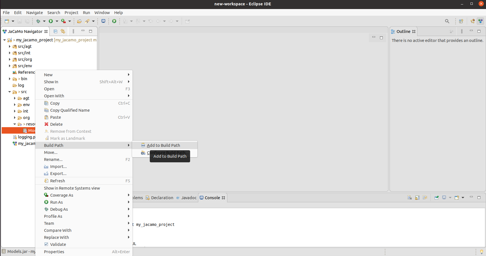

Crie um novo arquivo na raiz do projeto chamado `build.gradle` 

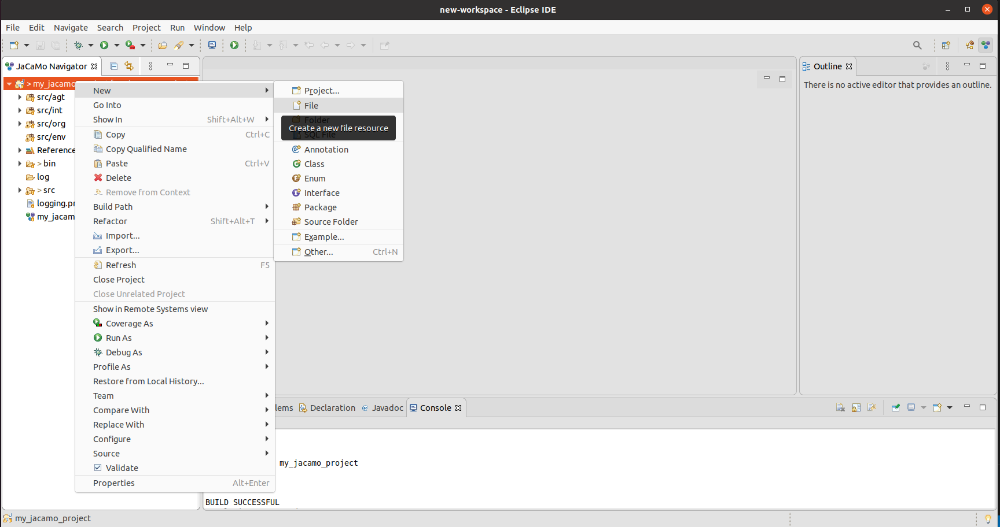

e adicione nesse arquivo o seguinte código:

```
plugins {
    id 'java'
    id 'eclipse'
}

repositories {
    mavenCentral()

    maven { url "http://jacamo.sourceforge.net/maven2" }
    maven { url "https://repo.gradle.org/gradle/libs-releases-local" }
    maven { url "https://jitpack.io" }
    
    flatDir {
       dirs 'lib'
    }
}

dependencies {
	compile group: 'org.jacamo' , name: 'jacamo'   , version: '0.9-SNAPSHOT'  , changing: true , transitive: true

	compile 'org.jason-lang:jason:2.5-SNAPSHOT'
	compile 'javax.xml.bind:jaxb-api:+'
	
		
	compile 'org.glassfish.jersey.containers:jersey-container-servlet:2.29.1'
	compile 'org.glassfish.jersey.containers:jersey-container-servlet-core:2.29.1'
	compile 'org.glassfish.jersey.inject:jersey-hk2:2.29.1'
	compile group: 'org.glassfish.jersey', name: 'jersey-bom', version: '2.29.1', ext: 'pom'

	compile 'org.glassfish.jersey.core:jersey-server:2.29.1'
	compile 'org.glassfish.jersey.core:jersey-client:2.29.1'
	compile 'org.glassfish.jersey.media:jersey-media-multipart:2.29.1'

	compile 'org.glassfish.jersey.media:jersey-media-json-jackson:2.29.1'

	// containers:
	compile 'org.glassfish.jersey.containers:jersey-container-grizzly2-http:2.29.1'
	compile 'org.glassfish.grizzly:grizzly-http-server:2.4.4'
	
	compile 'org.apache.zookeeper:zookeeper:3.5.4-beta'
	compile 'org.apache.curator:curator-framework:4.0.1'
	compile 'org.apache.curator:curator-x-async:4.0.1'
	

	compile 'com.google.code.gson:gson:2.8.5'
	
	implementation 'com.github.eishub:eis:v0.6.2'
	
	implementation files('lib/Models.jar')
		
}

task run (type: JavaExec, dependsOn: 'classes') {
    description 'runs the application'
    group ' JaCaMo'
    main = 'jacamo.infra.JaCaMoLauncher'
    args '<yourJcmFile>.jcm'
    classpath sourceSets.main.runtimeClasspath
}

sourceSets {
    main {
        java {
            srcDir 'src/env'
            srcDir 'src/agt'
        }
    }
}

```

Substitua `<yourJcmFile>.jcm` pelo nome do seu arquivo `.jcm`.  
Agora, clique no projeto com o botão direito e selecione `Configure/Add Gradle Nature` para que o eclipse entenda que precisa importar as classes do gradle.  
Ele pode levar algum tempo para sincronizar.

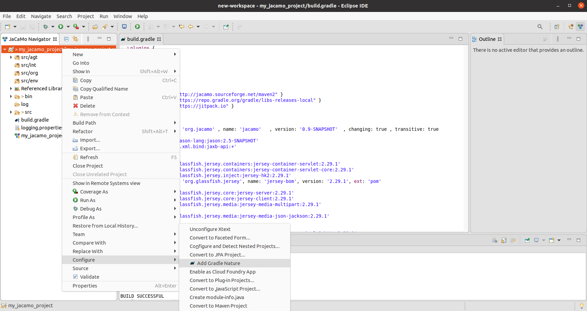

Em `src/env` crie um novo pacote com o nome `br.pucrs.smart`

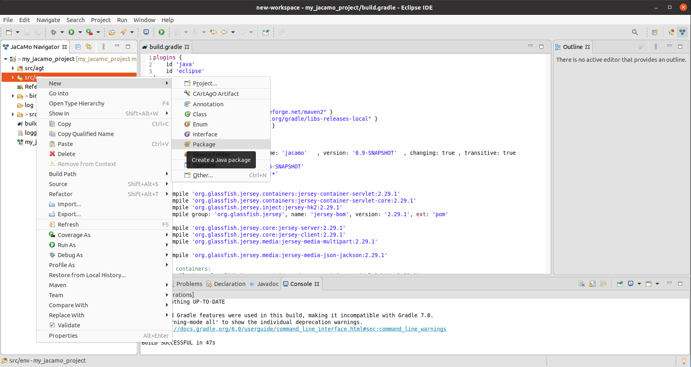

Baixe as classes a seguir e coloque no pacote recém criado:

**Ao invés de baixar uma classe por vez, você pode baixar todas as classes citadas a seguir compactadas neste arquivo [classes.zip](https://github.com/DeboraEngelmann/helloworld_from_jason/blob/master/src/resources/classes.zip) e descompactá-lo para obter as classes transferindo-as para a pasta `src/br/pucrs/smart`**

- [IntegrationArtifact.java](https://github.com/DeboraEngelmann/helloworld_from_jason/blob/master/src/env/br/pucrs/smart/IntegrationArtifact.java)
- [RestAppConfig.java](https://github.com/DeboraEngelmann/helloworld_from_jason/blob/master/src/env/br/pucrs/smart/RestAppConfig.java)
- [RestArtifact.java](https://github.com/DeboraEngelmann/helloworld_from_jason/blob/master/src/env/br/pucrs/smart/RestArtifact.java)
- [RestImpl.java](https://github.com/DeboraEngelmann/helloworld_from_jason/blob/master/src/env/br/pucrs/smart/RestImpl.java)

Crie em `src/env` um novo pacote com o nome `br.pucrs.smart.interfaces`, baixe a classe a seguir e coloque-a dentro dele.

- [IAgent.java](https://github.com/DeboraEngelmann/helloworld_from_jason/blob/master/src/env/br/pucrs/smart/interfaces/IAgent.java)

Crie um agente Jason para se comunicar com o Dialogflow e coloque nele o código a seguir:

```
+request(Req)
	:true
<-
	.print("Recebido request ",Req," do Dialog");
	!responder(Req);
	.
	
+!responder(Req)
	: (Req == "Call Jason Agent")
<-
	reply("Olá, eu sou seu agente Jason, em que posso lhe ajudar?");
	.
+!responder(Req)
	: true
<-
	reply("Desculpe, não reconheço essa intenção");
	.
	
+!hello
    : True
<-
    .print("hello world");
    .

{ include("$jacamoJar/templates/common-cartago.asl") }
{ include("$jacamoJar/templates/common-moise.asl") }
```

Inclua o seu novo agente, o artefato de comunicação e o server no seu arquivo `.jcm`

ex.
```
  agent communicating_agent:communicating_agent.asl{
    focus: integration
  }
    
	workspace wp{
		artifact integration:br.pucrs.smart.IntegrationArtifact
	}
	
	platform: br.pucrs.smart.RestArtifact("--main 2181 --restPort 8080")

```

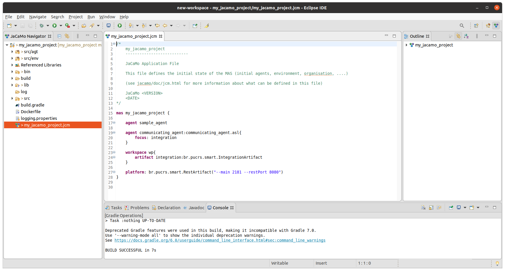


Para rodar o projeto, abra a pasta do projeto no terminal e digite o comando `gradle build` (isso pode levar algum tempo) em seguida rode o comando `gradle run`.


Caso queira criar imagens Docker apartir dessa aplicação crie na raiz do projeto um novo arquivo chamado `Dockerfile` e coloque nele o código a seguir.  
**O processo para a criação da imagem é o mesmo que consta em [Criando imagem Docker](#criando-imagem-docker)**

```
FROM alpine

ENV JAVA_HOME /usr/lib/jvm/java-1.8-openjdk
ENV JACAMO_HOME=/jacamo/build
ENV PATH $PATH:$JAVA_HOME/bin #:$JACAMO_HOME/scripts

RUN apk add --update --no-cache git gradle openjdk8-jre bash fontconfig ttf-dejavu graphviz
RUN git clone https://github.com/jacamo-lang/jacamo.git && \
    cd jacamo && \
    gradle config

COPY . /app

RUN cd app && gradle build

EXPOSE 3271
EXPOSE 3272
EXPOSE 3273
EXPOSE 8080

WORKDIR /app


ENTRYPOINT [ "gradle", "run" ]

CMD []
```


